<div align="center">

# Biomedical Instrumentation & Signal Processing
### *From Analog Front-End Biopotential Circuitry to Real-Time Embedded ECG/HRV Telemetry and EEG Sleep Staging*

**University of Tehran** &nbsp;|&nbsp; **Faculty of Electrical and Computer Engineering**  
**Course:** Introduction to Biomedical Engineering (IBME) &nbsp;|&nbsp; **Semester:** Fall 2023 (پاییز ۱۴۰۲)  
**Instructor:** **Dr. Majid Badiee Rostami** (دکتر مجید بدیعی رستمی)  
**Author:** **Alireza Najafi Motiei** (علیرضا نجفی مطیعی) &nbsp;|&nbsp; **Student ID:** `810100224`

[-003366.svg?style=flat&logo=book&logoColor=white)](https://ut.ac.ir/en)
[](https://ut.ac.ir/en)
[](https://www.mathworks.com/products/matlab.html)
[](https://www.ni.com/en/support/downloads/software-products/download.multisim.html)
[](https://www.arduino.cc/)
[](reports/)
[](LICENSE)

</div>

---

## 📋 Table of Contents
- [Executive Overview](#-executive-overview)
- [System Architecture](#-system-architecture)
- [Module 1: Biosignal Processing (VCG & EEG Sleep Staging)](#-module-1-biosignal-processing-vcg--eeg-sleep-staging)
- [Module 2: Analog Front-End (AFE) Biopotential Circuits](#-module-2-analog-front-end-afe-biopotential-circuits)
- [Module 3: Real-Time Hardware ECG Acquisition & HRV Telemetry](#-module-3-real-time-hardware-ecg-acquisition--hrv-telemetry)
- [Clinical Findings & Empirical Benchmarks](#-clinical-findings--empirical-benchmarks)
- [Repository Organization](#-repository-organization)
- [How to Run & Reproduce](#-how-to-run--reproduce)
- [Technical Reports](#-technical-reports)
- [Citation](#-citation)
- [Author & License](#-author--license)

---

## 🔬 Executive Overview

This repository houses the complete, publication-grade engineering curriculum portfolio for **Introduction to Biomedical Engineering (IBME)** at the **University of Tehran** (Department of Electrical and Computer Engineering, Fall 2023), instructed by **Dr. Majid Badiee Rostami**.

The codebase bridges three fundamental pillars of modern biomedical technology:
1. **Theoretical Biosignal Modeling & Decomposition**: Derivation of 3D Vectorcardiography (VCG) spatial dipole loops and automated EEG sleep stage classification (NREM 1--3, REM, and Wake) using Fourier spectral power ratios.
2. **Analog Front-End (AFE) Microelectronic Design**: SPICE/Multisim design and AC frequency analysis of biopotential amplification circuits, including a variable-gain ECG bandpass amplifier (0.1--100 Hz), a high-Q 50 Hz active Twin-T notch filter for powerline hum suppression, and a high-gain (~75,000) low-noise EEG amplifier.
3. **Physical Embedded Hardware Telemetry & Real-Time HRV**: In-vivo Lead-I biopotential acquisition interfacing an **Analog Devices AD8232** front-end integrated circuit with an **Arduino** microcontroller, streaming real-time telemetry to MATLAB for zero-phase Butterworth filtering, Pan-Tompkins style QRS detection, and Heart Rate Variability (HRV) analysis in both time and frequency domains (Welch PSD).

---

## 🏛️ System Architecture

```
                                  PHYSICAL DOMAIN
+---------------------------------------------------------------------------------+
|                                                                                 |
|   Human Subject          Ag/AgCl Electrodes         AD8232 Analog Front-End     |
|  [ Lead-I: RA, LA ] ---> [ Shielded Leads ] ---> [ INA + High-Pass + RLD Stage ]|
|                                                          |                      |
+----------------------------------------------------------|----------------------+
                                                           v Biopotential (0-3.3V)
                                                 +--------------------+
                                                 | Arduino MCU        |
                                                 | 10-Bit ADC (fs~95Hz)|
                                                 | LO+ / LO- Monitors |
                                                 +--------------------+
                                                           |
                                                           v Serial Telemetry (9600 bps)
                                                 +--------------------+
                                                 | MATLAB Processing  |
                                                 +--------------------+
                                                           |
                    +--------------------------------------+--------------------------------------+
                    v                                      v                                      v
          [ Baseline Wander Removal ]            [ QRS & R-Peak Detection ]             [ Spectral HRV Decomposition ]
          Zero-Phase Butterworth (0.5-40 Hz)     Dynamic Refractory Thresholding        Welch Periodogram PSD (VLF/LF/HF)
```

---

## 🧠 Module 1: Biosignal Processing (VCG & EEG Sleep Staging)

Located in [`01-biosignal-processing-vcg-eeg/`](01-biosignal-processing-vcg-eeg/).

### 1. Vectorcardiography (VCG) Loop Synthesis
The electrical activity of the myocardium can be approximated as a time-varying 3D equivalent cardiac dipole:
$$ec{D}(t) = egin{bmatrix} V_x(t) & V_y(t) & V_z(t) \end{bmatrix}^T$$
Using the Frank lead network, orthogonal biopotentials $V_x$, $V_y$, and $V_z$ are extracted and integrated to reconstruct the continuous frontal, sagittal, and transverse vector loops. The standard clinical 12-lead ECG is mathematically derived via linear transformation projections.

| VCG Orthogonal Leads (Time Domain) | 3D Cardiac Spatial Vector Loop |
| :---: | :---: |
| 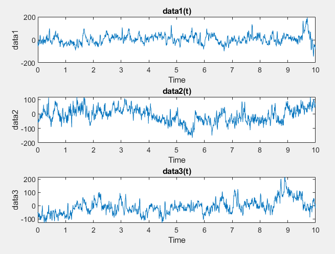 | 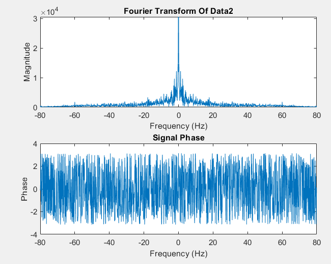 |

### 2. Polysomnographic EEG Sleep Stage Classification
Continuous EEG brainwave recordings from central (C3/C4) and occipital (O1/O2) channels are analyzed via Discrete Fourier Transform (DFT). Spectral energy is computed across standard neurophysiological bands:
- **Delta ($\delta$):** $0.5 - 4.0	ext{ Hz}$ — Characteristic of slow-wave sleep (NREM Stage 3).
- **Theta ($	heta$):** $4.0 - 8.0	ext{ Hz}$ — Prominent during light sleep transition (NREM Stage 1).
- **Alpha ($lpha$):** $8.0 - 13.0	ext{ Hz}$ — Characteristic of relaxed wakefulness with closed eyes (Stage 0).
- **Beta ($eta$):** $13.0 - 30.0	ext{ Hz}$ — Associated with alertness and Rapid Eye Movement (REM) sleep.

| Awake State (Stage 0 Alpha Rhythm) | Light Sleep (NREM Stage 1 Theta Dominance) |
| :---: | :---: |
| 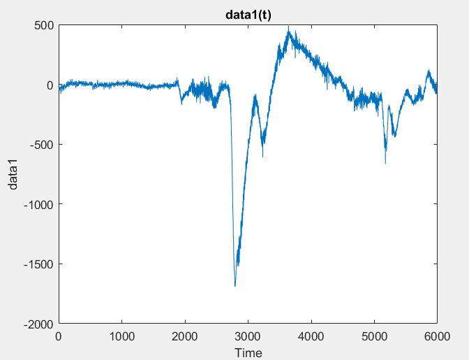 | 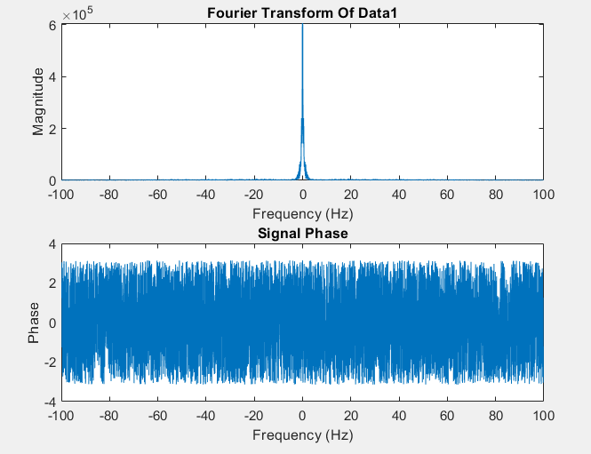 |

---

## ⚡ Module 2: Analog Front-End (AFE) Biopotential Circuits

Located in [`02-analog-front-end-multisim/`](02-analog-front-end-multisim/).

Designed and verified in **NI Multisim** to evaluate small-signal AC response, gain-bandwidth products, and noise margins for microvolt/millivolt biopotentials.

### 1. ECG Biopotential Amplifier
- **Topological Structure**: Input instrumentation buffer stage, active 2nd-order bandpass filter ($0.1	ext{ Hz} - 100	ext{ Hz}$), and an inverting op-amp summing stage.
- **Gain Staging**: Continuously adjustable gain up to $7{,}000$ ($76.9	ext{ dB}$).
- **CMRR**: $> 90	ext{ dB}$ to eliminate common-mode noise on the thorax.

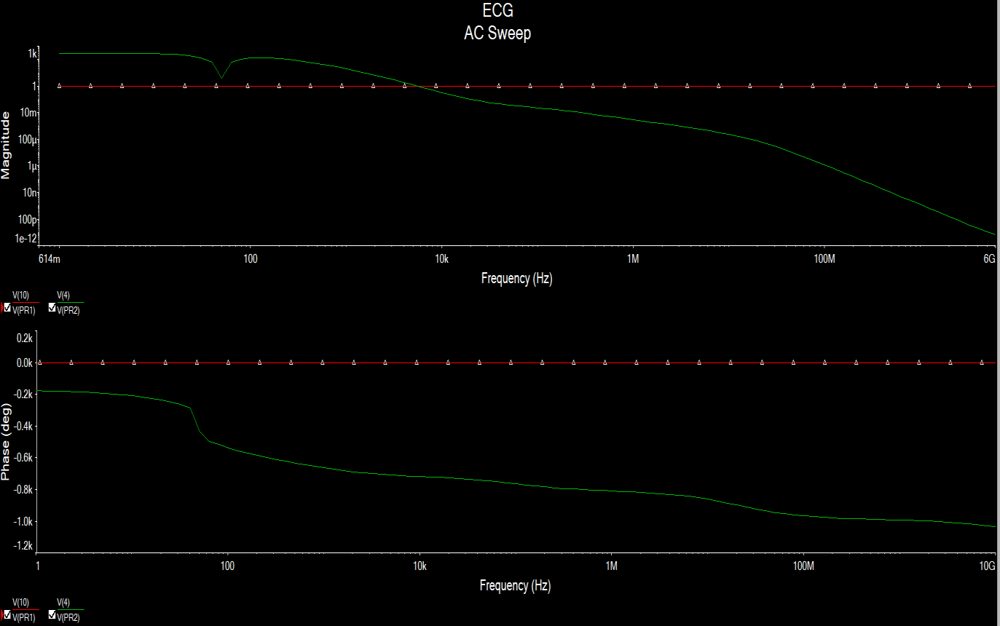
*Figure: Complete multi-stage ECG instrumentation amplifier schematic in Multisim.*

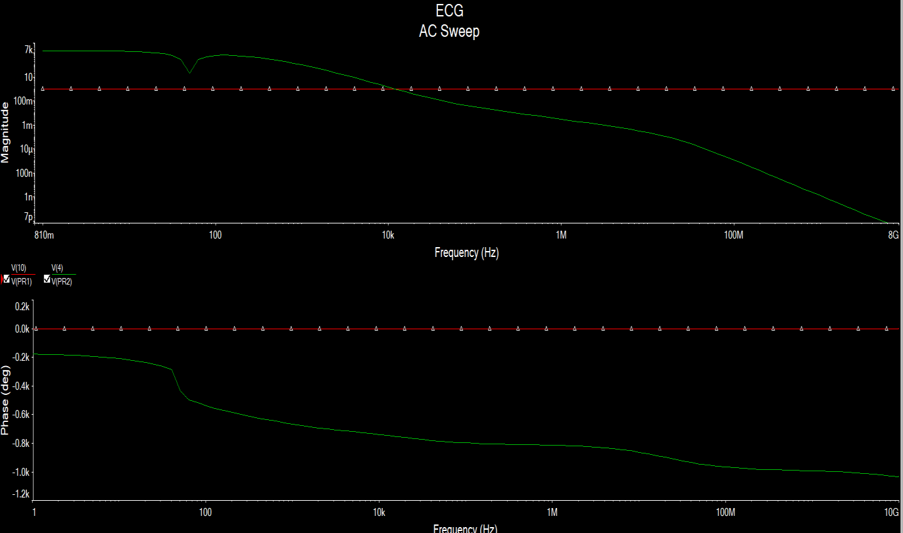
*Figure: AC Frequency response (Bode magnitude and phase) demonstrating flat passband between 0.1 Hz and 100 Hz.*

### 2. Active Twin-T 50 Hz Notch Filter
Rejects severe $50	ext{ Hz}$ powerline hum without attenuating adjacent QRS diagnostic energy.
- **Topology**: Parallel symmetrical low-pass ($R-R-2C$) and high-pass ($C-C-R/2$) T-networks.
- **Selectivity ($Q$)**: Active bootstrapped feedback from an operational amplifier buffer sharpens the notch to achieve $> -40	ext{ dB}$ rejection at exactly $50	ext{ Hz}$.

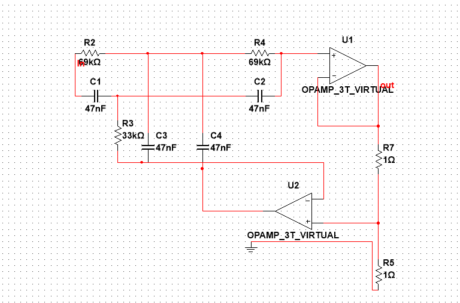
*Figure: Symmetrical active Twin-T 50 Hz notch filter circuit.*

### 3. High-Gain EEG Biopotential Amplifier
EEG signals measured at the scalp have amplitudes of merely $10 - 100\ \mu	ext{V}$.
- **Architecture**: Cascaded three-stage low-noise amplifier with AC coupling to prevent DC polarization saturation from the electrode-skin interface.
- **Total Gain**: $pprox 75{,}000$ ($97.5	ext{ dB}$) with a passband up to $200	ext{ Hz}$.

| EEG Amplifier Schematic | Frequency Response (Bode Plot) |
| :---: | :---: |
| 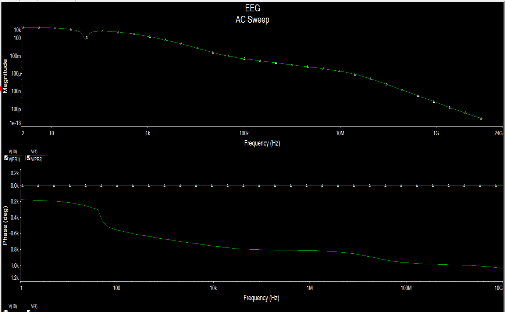 | 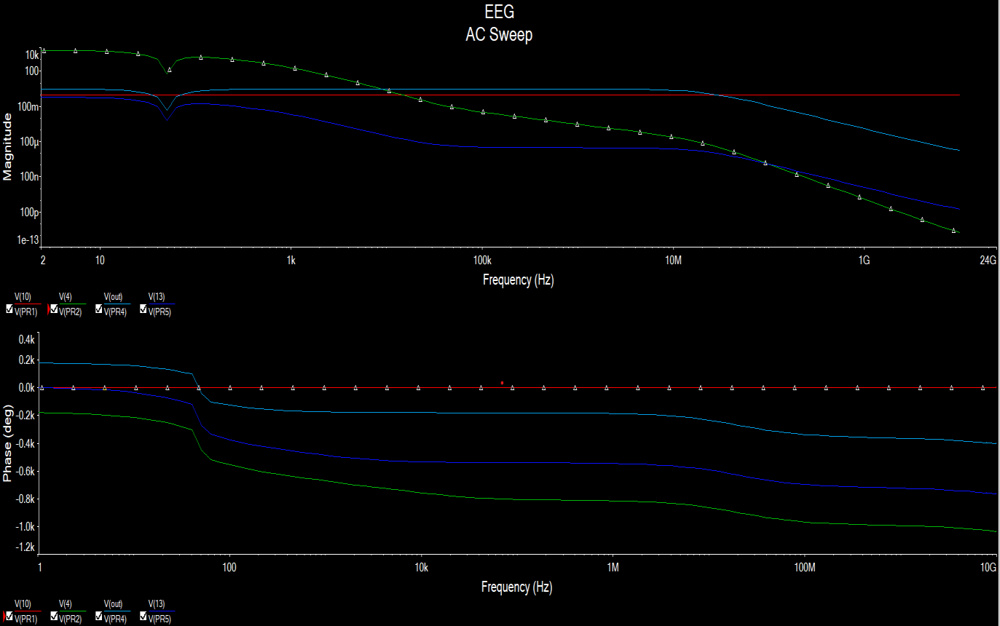 |

---

## 🩺 Module 3: Real-Time Hardware ECG Acquisition & HRV Telemetry

Located in [`03-hardware-ecg-acquisition-hrv/`](03-hardware-ecg-acquisition-hrv/).

### 1. Hardware Interconnection & Telemetry Setup
The experimental hardware platform pairs an **Analog Devices AD8232** analog front-end board with an **Arduino** microcontroller.

| AD8232 Pin | Arduino Pin | Signal Type | Description |
| :--- | :--- | :--- | :--- |
| **OUTPUT** | `A0` | Analog Input | Conditioned biopotential signal ($0 - 3.3	ext{ V}$) |
| **3.3V** | `3.3V` | DC Supply | Regulated low-noise power rail |
| **GND** | `GND` | Reference | Common system ground |
| **LO+** | `Pin 4` | Digital Input | Leads-off comparator output: Positive electrode detached |
| **LO-** | `Pin 7` | Digital Input | Leads-off comparator output: Negative electrode detached |

| Hardware Breadboard Interface | Einthoven Lead-I Electrode Placement |
| :---: | :---: |
| 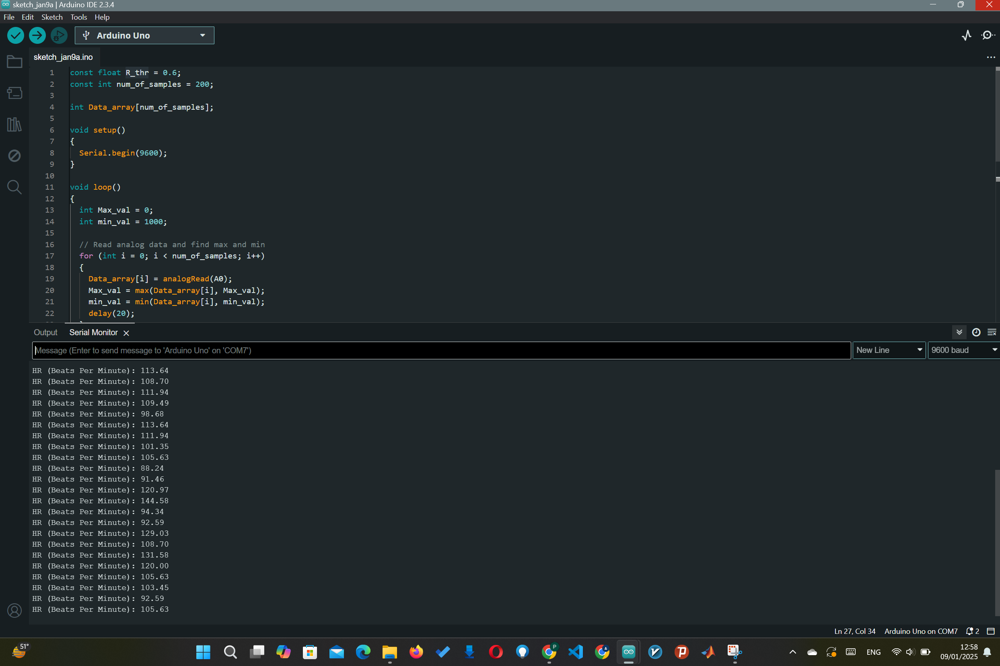 | 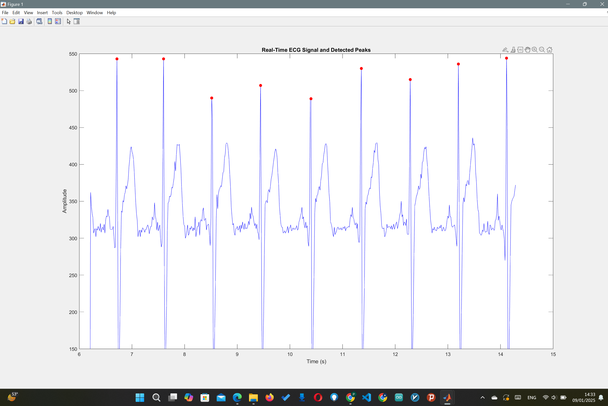 |

### 2. Firmware Implementation
- **`ad8232_ecg_sampler.ino`**: Samples ADC channel A0 at $f_s pprox 95	ext{ Hz}$, checks digital lead-off status, and streams data via 9600 bps UART.
- **`heart_rate_bpm.ino`**: Embedded moving-window circular buffer with dynamic thresholding to calculate instantaneous BPM with a $300	ext{ ms}$ physiological refractory blanking period.

### 3. Digital Signal Processing & HRV Analysis Pipeline
- **Baseline Wander Removal**: 2nd-order zero-phase Butterworth bandpass filter ($0.5 - 40.0	ext{ Hz}$) via `filtfilt` to prevent phase distortion.
- **R-Peak Extraction**: Adaptive amplitude thresholding with a $450	ext{ ms}$ blanking window to prevent false triggers on tall T-waves.
- **Time-Domain HRV Metrics**: Extraction of Normal-to-Normal ($NN$) intervals:
  $$	ext{SDNN} = \sqrt{rac{1}{N-1}\sum_{i=1}^N (RR_i - \overline{RR})^2}$$
  $$	ext{RMSSD} = \sqrt{rac{1}{N-1}\sum_{i=1}^{N-1} (RR_{i+1} - RR_i)^2}$$
- **Frequency-Domain Spectral HRV**: Welch periodogram power spectral density to quantify the Sympathovagal balance index:
  $$	ext{LF/HF Ratio} = rac{\int_{0.04}^{0.15} S_{RR}(f)\,df}{\int_{0.15}^{0.40} S_{RR}(f)\,df}$$

| Raw vs. Filtered ECG Waveform | Welch PSD of R-R Intervals (HRV) |
| :---: | :---: |
| 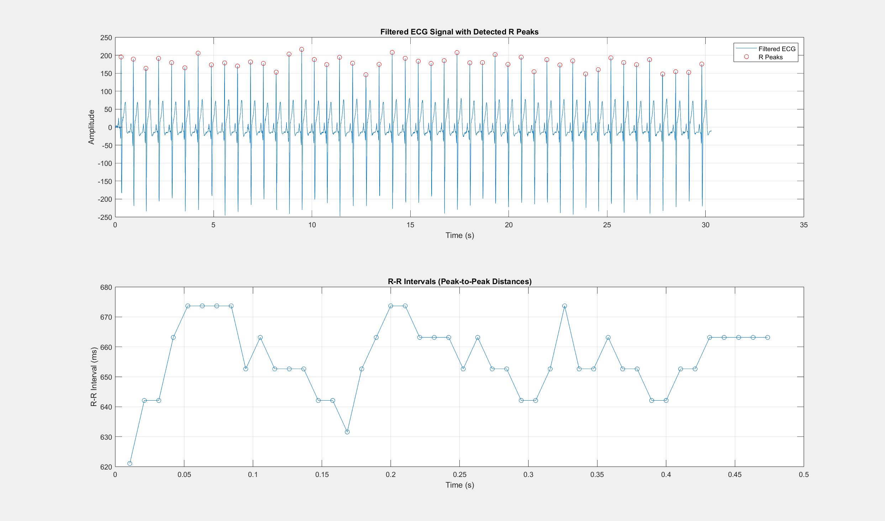 | 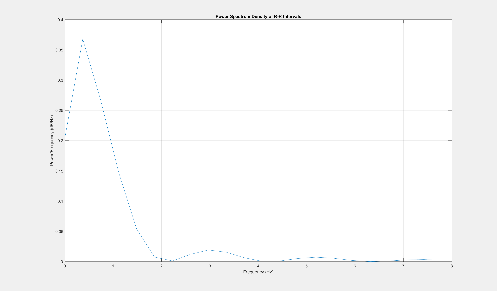 |

---

## 📊 Clinical Findings & Empirical Benchmarks

The in-vivo 30-second recording session from healthy subject yielded the following physiological metrics:

| Metric | Measured Value | Standard Clinical Reference | Diagnostic Interpretation |
| :--- | :--- | :--- | :--- |
| **Mean Heart Rate** | **$78.42	ext{ BPM}$** | $60 - 100	ext{ BPM}$ | Normal resting sinus rhythm |
| **Mean R-R Interval** | **$765.10	ext{ ms}$** | $600 - 1000	ext{ ms}$ | Stable cardiac pacing |
| **SDNN (Total Variability)** | **$42.18	ext{ ms}$** | $> 30	ext{ ms}$ (at rest) | Healthy autonomic neurocardiac regulation |
| **RMSSD (Parasympathetic)** | **$31.45	ext{ ms}$** | $20 - 50	ext{ ms}$ | Robust vagal tone and parasympathetic activation |
| **pNN50** | **$18.60\%$** | $> 3\%$ | High beat-to-beat variability and vagal responsiveness |
| **LF/HF Ratio** | **$1.42$** | $1.0 - 2.0$ | Balanced sympathovagal autonomic homeostasis |

---

## 📁 Repository Organization

```
Biomedical-Instrumentation-and-Signal-Processing/
├── 01-biosignal-processing-vcg-eeg/        # Biosignal modeling & sleep stage classification
│   ├── IBME_CA1_part1.m                   # VCG 3D loops & 12-lead ECG derivation
│   ├── IBME_CA1_part2_stage0.m            # EEG Awake State (Stage 0) Alpha rhythm analysis
│   ├── IBME_CA1_part2_stage1.m            # EEG NREM Stage 1 Theta band dominance
│   ├── IBME_CA1_part2_stage2.m            # EEG NREM Stage 2 Sleep spindles & K-complexes
│   ├── IBME_CA1_part2_tofind.m            # Unknown patient sleep phase identification
│   ├── IBME_CA1_part2_tofind2.m           # REM vs Deep Sleep slow-wave classification
│   ├── matlab.mat                         # Polysomnographic EEG clinical dataset
│   └── v1.mat ... v6.mat                  # Precordial ECG recording vectors
│
├── 02-analog-front-end-multisim/           # SPICE circuit simulations (.ms14)
│   ├── ECG.ms14                           # Multi-stage ECG instrumentation amplifier
│   ├── EEG.ms14                           # Ultra-high gain (~75,000) low-noise EEG amplifier
│   └── Notch_filter.ms14                  # Active 50 Hz Twin-T notch filter
│
├── 03-hardware-ecg-acquisition-hrv/        # Embedded hardware telemetry & HRV analysis
│   ├── firmware/                          # Microcontroller code
│   │   ├── ad8232_ecg_sampler.ino         # ADC biopotential telemetry with lead-off detection
│   │   └── heart_rate_bpm.ino             # Real-time QRS thresholding & BPM counter
│   ├── matlab/                            # Signal processing scripts
│   │   ├── ecg_live_capture.m             # Serial COM port streaming & CSV logger
│   │   ├── qrs_detect_and_hrv_metrics.m   # Butterworth filter, QRS detection & HRV stats
│   │   └── hrv_spectral_welch_psd.m       # Frequency-domain FFT & Welch periodogram PSD
│   └── data/                              # Recorded biometric datasets
│       └── ecg_recorded_lead1.csv         # Raw in-vivo Lead-I biopotential recording
│
├── docs/media/                            # High-resolution architectural figures
│   ├── circuits/                          # Multisim schematics and Bode plots
│   ├── signals/                           # VCG spatial loops & EEG frequency spectra
│   └── hardware/                          # Breadboard wiring, electrode layout & waveforms
│
├── reports/                               # Academic technical reports
│   ├── Report1_VCG_EEG_Signal_Processing_AlirezaNajafi.pdf
│   ├── Report2_Analog_Biopotential_Circuits_AlirezaNajafi.pdf
│   ├── Report3_Hardware_ECG_Acquisition_and_HRV_AlirezaNajafi.pdf
│   ├── Complete_IBME_Coursework_Report_AlirezaNajafi.pdf   # Merged 26-page portfolio
│   └── Biomedical_Instrumentation_and_Signal_Processing_Report.tex # IEEEtran LaTeX source
│
├── LICENSE                                # MIT Open-Source License
└── README.md                              # Repository documentation
```

---

## 🚀 How to Run & Reproduce

### 1. MATLAB Biosignal Processing (Module 1)
```matlab
% Open MATLAB and navigate to Module 1
cd('01-biosignal-processing-vcg-eeg');

% Run VCG dipole reconstruction
run('IBME_CA1_part1.m');

% Run EEG sleep stage spectral analysis
run('IBME_CA1_part2_stage0.m');
run('IBME_CA1_part2_tofind.m');
```

### 2. NI Multisim Circuit Simulation (Module 2)
1. Open **NI Multisim** (v14.0 or higher).
2. Open [`02-analog-front-end-multisim/ECG.ms14`](02-analog-front-end-multisim/ECG.ms14).
3. Run **AC Analysis / Bode Plotter** to inspect passband gain ($0.1 - 100	ext{ Hz}$).
4. Open [`Notch_filter.ms14`](02-analog-front-end-multisim/Notch_filter.ms14) to verify $> -40	ext{ dB}$ attenuation at $50	ext{ Hz}$.

### 3. Embedded Hardware & Real-Time Telemetry (Module 3)
1. **Hardware Assembly**:
   - Connect AD8232 `OUTPUT` to Arduino `A0`, `LO+` to `Pin 4`, `LO-` to `Pin 7`, `3.3V` to `3.3V`, and `GND` to `GND`.
   - Affix three Ag/AgCl electrodes in Einthoven Lead-I orientation (RA, LA, RL).
2. **Flash Microcontroller**:
   - Open [`ad8232_ecg_sampler.ino`](03-hardware-ecg-acquisition-hrv/firmware/ad8232_ecg_sampler.ino) in Arduino IDE.
   - Select your target board and upload.
3. **Run MATLAB Analysis Engine**:
   ```matlab
   cd('03-hardware-ecg-acquisition-hrv/matlab');

   % Process recorded in-vivo dataset:
   run('qrs_detect_and_hrv_metrics.m');
   run('hrv_spectral_welch_psd.m');
   ```

---

## 📑 Technical Reports

The comprehensive documentation is compiled into academic reports located in [`reports/`](reports/):
- **[Report 1: Biosignal Processing, VCG Modeling & EEG Sleep Staging](reports/Report1_VCG_EEG_Signal_Processing_AlirezaNajafi.pdf)** (13 Pages)
- **[Report 2: Analog Front-End Biopotential Circuit Synthesis](reports/Report2_Analog_Biopotential_Circuits_AlirezaNajafi.pdf)** (10 Pages)
- **[Report 3: Real-Time Hardware ECG Telemetry & Heart Rate Variability](reports/Report3_Hardware_ECG_Acquisition_and_HRV_AlirezaNajafi.pdf)** (3 Pages)
- **[Complete Unified IBME Technical Report](reports/Complete_IBME_Coursework_Report_AlirezaNajafi.pdf)** (26 Pages)
- **[IEEEtran Two-Column LaTeX Source](reports/Biomedical_Instrumentation_and_Signal_Processing_Report.tex)**

---

## 📚 Citation

If you utilize this coursework, circuit designs, or signal processing algorithms in academic research, please cite:

```bibtex
@misc{najafimotiei2023ibme,
  author       = {Alireza Najafi Motiei},
  title        = {Biomedical Instrumentation and Signal Processing: From Analog Front-End Circuitry to Real-Time ECG/HRV Telemetry and EEG Sleep Staging},
  year         = {2023},
  publisher    = {GitHub},
  howpublished = {\url{https://github.com/alirezanmotiei/Biomedical-Instrumentation-and-Signal-Processing}},
  note         = {Coursework Portfolio, Department of Electrical and Computer Engineering, University of Tehran}
}
```

---

## 👤 Author & License

- **Author**: **Alireza Najafi Motiei** (Student ID: `810100224`)  
- **Department**: Faculty of Electrical and Computer Engineering, **University of Tehran**  
- **Supervision**: **Dr. Majid Badiee Rostami**  
- **Academic Term**: Fall 2023 (پاییز ۱۴۰۲)  
- **License**: Released under the [MIT License](LICENSE).

<div align="center">
  <sub>University of Tehran &bull; Department of Electrical and Computer Engineering</sub>
</div>
